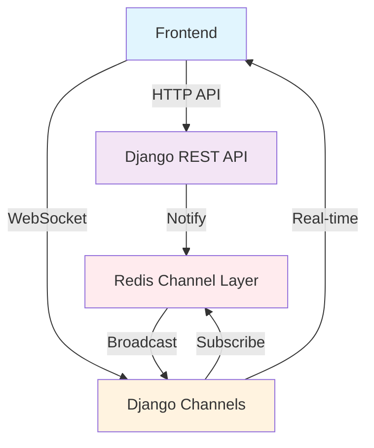

# 🎓 eLearning Platform

<div align="center">


### 🚀 A modern, full-stack e-learning platform with real-time chat and notifications

### ✨ Real-time Learning • Role-based Access • Modern UI/UX

</div>

---

## 📖 Table of Contents

- [🎬 Demo Video](#-demo-video)
- [✨ Features](#-features)
- [🏗️ Architecture](#️-architecture)
- [🔐 Authentication & Security](#-authentication--security)
- [💻 Frontend Design](#-frontend-design)
- [🌐 REST API](#-rest-api)
- [⚡ WebSockets](#-websockets)
- [🧪 Testing](#-testing)
- [🚀 Quick Start](#-quick-start)
- [📊 Evaluation](#-evaluation)
- [📄 Dependencies](#-dependencies)
- [📜 License & Acknowledgments](#-license--acknowledgments)

## 🎬 Demo Video

<div align="center">

[](https://www.youtube.com/watch?v=rUQ9CwhClLI&t=90s&ab_channel=WuYue)

**🎥 [Watch the Full Demo on YouTube](https://www.youtube.com/watch?v=rUQ9CwhClLI&t=90s&ab_channel=WuYue)**

_Experience the platform's real-time features, role-based interfaces, and seamless user interactions_

</div>

## ✨ Features

<div align="center">

### 🎯 **Complete Learning Management Solution**

</div>

<table>
<tr>
<td width="50%" align="center">

### 🎓 **Core Functionality**


- 👥 **Role-based Access Control** - Separate interfaces for teachers and students
- 📚 **Course Management** - Create, manage, and enroll in courses
- 📝 **Real-time Chat** - Instant messaging with file attachments
- 🔔 **Live Notifications** - Real-time updates for course activities
- 📊 **Progress Tracking** - Monitor student engagement and completion

</td>
<td width="50%" align="center">

### 🛡️ **Security & Authentication**


- 🔐 **JWT Authentication** - Secure token-based authentication
- 🛂 **Permission System** - Fine-grained access control
- 🔒 **Secure File Uploads** - Organized media management
- 🚪 **Secure Logout** - Token blacklisting and session management

</td>
</tr>
<tr>
<td width="50%" align="center">

### 🎨 **Modern UI/UX**


- 📱 **Responsive Design** - Built with Tailwind CSS
- ⚡ **Real-time Updates** - WebSocket-powered live features
- 🎭 **Role-adaptive Interface** - Dynamic UI based on user permissions
- 🎯 **Search Functionality** - Find courses and members quickly

</td>
<td width="50%" align="center">

### ⚡ **Performance & Scalability**


- 🔄 **Real-time Communication** - WebSocket + Redis integration
- 📊 **Database Optimization** - Strategic indexing and queries
- 🧪 **90% Test Coverage** - Reliable and maintainable code
- 🏗️ **Modular Architecture** - Scalable and extensible design

</td>
</tr>
</table>

## 🏗️ Architecture

This e-learning platform uses a **modular architecture** with clear separation of concerns:

### 🔧 Tech Stack

<div align="center">

|                              **Backend Technologies**                              |                                  **Frontend Technologies**                                   |                               **DevOps & Testing**                                |
| :--------------------------------------------------------------------------------: | :------------------------------------------------------------------------------------------: | :-------------------------------------------------------------------------------: |
|  |                  |    |
|                      |             |     |
|           |  |    |
|                    |    |  |

</div>

**🏗️ Architecture Highlights:**

- 🐍 **Django 5.1.3** - Robust web framework with modern features
- 🔌 **Django REST Framework** - Comprehensive API development
- � **Django Channels** - WebSocket support for real-time features
- ⚛️ **React + Next.js 14** - Modern frontend with SSR capabilities
- 📘 **TypeScript** - Type-safe development across the stack
- 🗃️ **Redis** - High-performance message broker and caching

### 🏛️ Database Design

<div align="center">


_Entity Relationship Diagram_

</div>

The platform implements **5 core modules** with normalized relationships:

| Module               | Purpose                 | Key Models                                           |
| -------------------- | ----------------------- | ---------------------------------------------------- |
| 👤 **Accounts**      | User management & roles | `CustomUser`                                         |
| 📚 **Courses**       | Course lifecycle        | `Course`, `CourseMaterial`, `Enrollment`, `Feedback` |
| 🔔 **Notifications** | System alerts           | `Notification`                                       |
| 💬 **Chat**          | Real-time messaging     | `ChatMessage`                                        |
| 🔌 **API**           | Centralized endpoints   | Router configuration                                 |

**Key Design Patterns:**

- ✅ **User Model Extension** - Extends Django's `AbstractUser`
- 🔗 **Normalized Relationships** - Junction tables with descriptive names
- 📁 **Organized File Management** - Separated upload directories
- 🗂️ **Soft Delete** - `is_active` flags preserve data
- 📊 **Metadata Tracking** - Automatic timestamps
- ⚡ **Performance Optimization** - Strategic database indexing

## 🔐 Authentication & Security

### 🛡️ JWT-Based Authentication

- 🔑 **Token Management** - Secure JWT with refresh capabilities
- 🚪 **Session Control** - Multi-tab support with consistent state
- 🔒 **Secure Logout** - Token blacklisting prevents reuse

### 👥 Role-Based Access Control

| Permission Class          | Purpose               | Access Level                              |
| ------------------------- | --------------------- | ----------------------------------------- |
| 🎓 **IsTeacher**          | Teacher-only features | Create courses, manage content            |
| 👨‍🎓 **IsStudent**          | Student-only features | Enroll in courses, submit feedback        |
| 🏫 **IsCourseTeacher**    | Course ownership      | Modify owned courses only                 |
| 📚 **IsEnrolledStudent**  | Enrollment-based      | Access enrolled course materials          |
| 🔄 **Hybrid Permissions** | Combined access       | Read-only for students, full for teachers |

### 🔐 Security Features

- ✅ **Object-level permissions** for fine-grained access control
- ✅ **Automatic redirects** for unauthenticated users
- ✅ **Role-adaptive UI** shows only relevant features
- ✅ **Secure file uploads** with organized directory structure

## 💻 Frontend Design

Built with **React + Next.js** and **TypeScript** for type safety and modern development practices.

### 🏗️ Project Structure

```
client/
├── app/                 # Next.js App Router pages
├── components/          # Reusable UI components
├── contexts/           # Global state management
├── lib/               # Core utilities & auth helpers
├── types/             # TypeScript definitions
└── utils/             # Feature-specific utilities
```

### 📱 Key Pages & Features

<table>
<tr>
<td width="50%">

**🏠 Core Pages**

- 👋 **Welcome Page** - Login/Register toggle
- 📊 **Dashboard** - Personal hub with profile management
- 📚 **Courses** - Course catalog with enrollment
- 📖 **Course Details** - Materials, enrollments, feedback
- 👥 **Members** - User directory (teachers only)
- 👤 **Member Profile** - Individual user details

</td>
<td width="50%">

**⚡ Interactive Components**

- 🔍 **Smart Search** - Role-based course/member search
- 🔔 **Live Notifications** - Real-time updates
- 💬 **Chat System** - Instant messaging with files
- 🎯 **Progress Tracking** - Course completion status
- 🎨 **Dynamic UI** - Role-adaptive interface

</td>
</tr>
</table>

### 🎨 Design Highlights

- 🎭 **Role-Based UI** - Different interfaces for teachers vs students
- ⚡ **Optimistic Updates** - Immediate UI feedback
- 🍞 **Toast Notifications** - User-friendly feedback system
- 📱 **Responsive Design** - Tailwind CSS components
- 🎯 **Context Management** - Clean state handling without prop drilling

## 🌐 REST API

Comprehensive RESTful API built with **Django REST Framework** featuring hierarchical routing and role-based permissions.

### 🔗 API Endpoints Overview

<details>
<summary><b>🔐 Authentication Endpoints</b></summary>

```http
POST /api/auth/login/          # JWT token acquisition
POST /api/auth/register/       # User registration
POST /api/auth/refresh/        # JWT token refresh
POST /api/auth/verify/         # JWT token verification
POST /api/auth/logout/         # Secure logout with token blacklisting
```

</details>

<details>
<summary><b>👤 User Management</b></summary>

```http
# Dashboard
GET    /api/dashboard/                    # Current user dashboard
PATCH  /api/dashboard/patch-status/       # Update user status
PATCH  /api/dashboard/patch-photo/        # Update profile photo

# Members (Teachers only)
GET    /api/members/                      # List all users
GET    /api/members/{id}/                 # User details
GET    /api/members/search/               # Search users by name
```

</details>

<details>
<summary><b>📚 Course Management</b></summary>

```http
GET    /api/courses/                      # List active courses
POST   /api/courses/                      # Create course (teachers)
GET    /api/courses/{id}/                 # Course metadata
PATCH  /api/courses/{id}/                 # Update course (owner)
PATCH  /api/courses/{id}/toggle_activation/  # Activate/deactivate
GET    /api/courses/search/               # Search courses
```

</details>

<details>
<summary><b>📖 Course Resources (Nested)</b></summary>

```http
# Materials
GET    /api/courses/{course_id}/materials/           # List materials
POST   /api/courses/{course_id}/materials/           # Add material (teacher)
DELETE /api/courses/{course_id}/materials/{id}/      # Delete material

# Feedback
GET    /api/courses/{course_id}/feedback/            # List feedback
POST   /api/courses/{course_id}/feedback/            # Add feedback (students)
DELETE /api/courses/{course_id}/feedback/{id}/       # Delete feedback

# Enrollments
GET    /api/courses/{course_id}/enrollments/         # List enrollments
POST   /api/courses/{course_id}/student-enrollment/  # Enroll (students)
DELETE /api/courses/{course_id}/student-enrollment/  # Leave course
```

</details>

<details>
<summary><b>💬 Communication</b></summary>

```http
# Chat
GET    /api/chat/                    # List chat sessions
POST   /api/chat/                    # Send message
GET    /api/chat/{id}/               # Chat session details
POST   /api/chat/mark_chat_read/     # Mark as read
POST   /api/chat/initialize/         # Initialize chat

# Notifications
GET    /api/notifications/           # List notifications
PATCH  /api/notifications/{id}/      # Mark as read
POST   /api/notifications/mark_all_read/  # Mark all read
```

</details>

### 🏗️ API Architecture Patterns

**🎯 Dynamic Permissions**

```python
def get_permissions(self):
    if self.action == "create":
        self.permission_classes = [IsAuthenticated, IsTeacher]
    elif self.action in ["update", "partial_update"]:
        self.permission_classes = [IsAuthenticated, IsCourseTeacher]
    return super().get_permissions()
```

**📊 Context-Aware Serialization**

- **List View**: Lightweight serializer for performance
- **Detail View**: Complete data with relationships
- **Create/Update**: Validation-focused serializers

**🔧 Custom Actions**

- Course activation/deactivation
- Bulk operations for enrollments
- Progress tracking and completion

## ⚡ WebSockets

Real-time communication powered by **Django Channels** and **Redis** for instant notifications and chat functionality.

### 🏗️ Architecture Overview

<div align="center">



</div>

### 🔄 Dual Communication Model

**🔔 Notifications**: Direct WebSocket Model

```
Backend Event → WebSocket → Frontend Display
```

- System notifications sent instantly
- Course enrollment alerts
- Material update notifications
- Efficient for simple content

**💬 Chat**: API-WebSocket Hybrid Model

```
Frontend → HTTP API → Database → WebSocket Notification → Frontend Update
```

- Messages with file attachments via HTTP
- Reliable persistence before notification
- Consistent state management
- Supports complex content types

### 🔐 Security & Authentication

**🔑 JWT WebSocket Authentication**

```javascript
// Token passed as query parameter
const ws = new WebSocket(`ws://localhost:8000/ws/chat/?token=${jwt_token}`);
```

**👥 User-Specific Channels**

- Each user has dedicated channel groups
- Prevents cross-user message leakage
- Supports concurrent connections

### 📡 Consumer Implementation

**NotificationConsumer**

- Handles system-generated alerts
- Direct WebSocket message delivery
- Lightweight for instant updates

**ChatConsumer**

- Manages real-time chat sessions
- Integrates with HTTP API for file uploads
- Maintains chat history and read status

## 🧪 Testing

Comprehensive test suite ensuring **90% code coverage** across the entire platform.

<div align="center">


_Automated test results showing 90% coverage_

</div>

### 🎯 Testing Strategy

**🏗️ Test Organization**

- **Modular Testing**: Each app has dedicated test files
- **Factory-Based Fixtures**: Consistent test data with Factory Boy
- **Isolated Tests**: Clean database state for each test
- **Edge Case Coverage**: Both happy paths and error conditions

**🔍 Test Categories**

| Test Type              | Coverage                     | Purpose                      |
| ---------------------- | ---------------------------- | ---------------------------- |
| 🔐 **Authentication**  | API endpoints, JWT tokens    | Verify secure access control |
| 🏛️ **Database Models** | Model methods, relationships | Ensure data integrity        |
| 🌐 **API Endpoints**   | All REST endpoints           | Validate request/response    |
| 🔒 **Permissions**     | Role-based access            | Test authorization rules     |
| ⚡ **WebSockets**      | Real-time features           | Chat and notifications       |

### 🛠️ Testing Tools

```python
# Factory Boy for test data
class UserFactory(factory.django.DjangoModelFactory):
    class Meta:
        model = User

    username = factory.Sequence(lambda n: f"user{n}")
    email = factory.LazyAttribute(lambda obj: f"{obj.username}@example.com")
```

**📊 Key Metrics**

- ✅ **90% Code Coverage** - Comprehensive test coverage
- ✅ **Automated Testing** - Django test framework integration
- ✅ **API Testing** - DRF test utilities for endpoint validation
- ✅ **Permission Testing** - Role-based access verification
- ✅ **WebSocket Testing** - Real-time feature validation

## 🚀 Quick Start

### 📋 Prerequisites

- **Python 3.12.9**
- **Node.js 18+**
- **Redis 7.2.7**
- **macOS/Linux** (Windows with WSL)

### ⚡ One-Command Setup

<details>
<summary><b>🔧 Backend Setup</b></summary>

1. **Start Redis Server**

   ```bash
   redis-server
   ```

2. **Setup Django Backend** _(in new terminal)_

   ```bash
   cd server
   conda create --name elearning-project python=3.12.9
   conda activate elearning-project
   pip install -r requirements.txt
   daphne -b 0.0.0.0 -p 8000 elearning.asgi:application
   ```

3. **Access Admin Panel**
   - URL: http://127.0.0.1:8000/admin/
   - Username: `admin`
   - Password: `admin`

</details>

<details>
<summary><b>🎨 Frontend Setup</b></summary>

_(in new terminal)_

```bash
cd client
npm install
npm run dev
```

**🌐 Access Application**: http://192.168.0.101:3000/

> 💡 **Note**: Update `NEXT_PUBLIC_API_URL` in `client/.env` if backend URL differs

</details>

### 👥 Demo Accounts

<div align="center">

|      Role       |              Username              |  Password   |                   Capabilities                   |
| :-------------: | :--------------------------------: | :---------: | :----------------------------------------------: |
| 🎓 **Teachers** | `teacher1`, `teacher2`, `teacher3` | `elearning` | Create courses, manage content, view all members |
| 👨‍🎓 **Students** |      `student1` - `student10`      | `elearning` |     Enroll in courses, submit feedback, chat     |
|  👨‍💼 **Admin**   |              `admin`               |   `admin`   |    Full system access via Django admin panel     |

💡 **Tip**: Try different accounts to experience role-based interfaces!

</div>

### 🧪 Run Tests

```bash
cd server
coverage run manage.py test
coverage report
```

## 📊 Evaluation

### ✅ Strengths

<table>
<tr>
<td width="50%">

**🏗️ Architecture Excellence**

- ⚛️ Modern React + Next.js frontend
- 🐍 Modular Django backend design
- 🔄 Hybrid API-WebSocket communication
- 🔐 Comprehensive JWT authentication

</td>
<td width="50%">

**🎯 Implementation Quality**

- 🧪 **90% test coverage** ensures reliability
- 🛡️ Fine-grained permission system
- ⚡ Real-time features enhance engagement
- 📊 Optimized database queries

</td>
</tr>
</table>

### 🔄 Areas for Improvement

| Category          | Current State          | Improvement Opportunity               |
| ----------------- | ---------------------- | ------------------------------------- |
| 🏗️ **API Design** | Django REST Framework  | Consider Django-Ninja for modern APIs |
| 🗃️ **Database**   | SQLite (development)   | PostgreSQL for production             |
| 📱 **Mobile**     | Limited responsiveness | Enhanced mobile experience            |
| 🚀 **Deployment** | Local development      | Production deployment setup           |
| 🔒 **Security**   | Basic validation       | Advanced rate limiting & validation   |

### 🚀 Future Roadmap

<details>
<summary><b>🎯 Short-term Goals</b></summary>

- 🐳 **Docker containerization** for easy deployment
- 📱 **Mobile-responsive design** improvements
- 🔍 **Advanced search** with filtering
- 📈 **Analytics dashboard** for teachers
- 🔔 **Email notifications** integration

</details>

<details>
<summary><b>🌟 Long-term Vision</b></summary>

- 🤖 **AI-powered** content recommendations
- 🎥 **Video streaming** for lectures
- 📊 **Advanced analytics** and progress tracking
- 🌍 **Multi-language** support
- 🔗 **Third-party integrations** (Google Classroom, Zoom)

</details>

### 🎓 Key Learnings

> 💡 **Planning is Everything**: Thorough requirements analysis upfront prevents costly refactoring later
>
> 🧪 **Test-Driven Development**: Writing tests first improves code quality and reduces debugging time
>
> 🏗️ **Modular Architecture**: Clean separation of concerns makes the codebase maintainable and scalable

## 📄 Dependencies

<details>
<summary><b>📦 Backend Requirements (requirements.txt)</b></summary>

```txt
Django==5.1.3
djangorestframework==3.15.2
djangorestframework_simplejwt==5.5.0
channels==4.2.0
channels_redis==4.2.1
django-cors-headers==4.7.0
redis==5.2.1
daphne==4.1.2
pillow==11.1.0
coverage==7.6.12
factory_boy==3.3.3
# ... see full list in requirements.txt
```

</details>

## 📜 License & Acknowledgments

<div align="center">

### 🎓 **Academic Project - CM3035 Advanced Web Development**

[](https://www.london.ac.uk/)
[](https://www.coursera.org/learn/advanced-web-development)

**Built with ❤️ by [Yue Wu](https://github.com/lothronx)**

_Demonstrating modern full-stack development practices, real-time technologies, and comprehensive testing strategies_

[](https://github.com/lothronx)
[](https://www.linkedin.com/in/yuewuxd/)
[](https://www.youtube.com/@wu_yue)

</div>

---

<div align="center">

### ⭐ **If this project helped you, please give it a star!** ⭐

[](https://github.com/lothronx/cm3035-elearning-platform)

</div>

</div>
