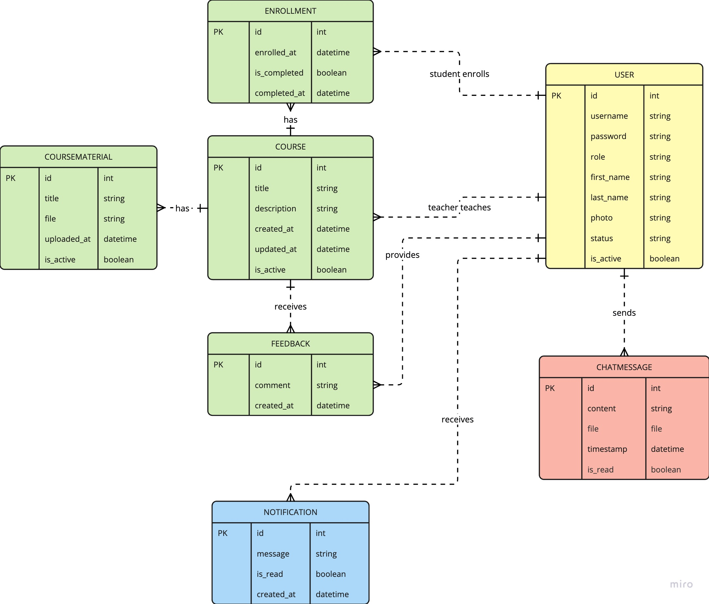
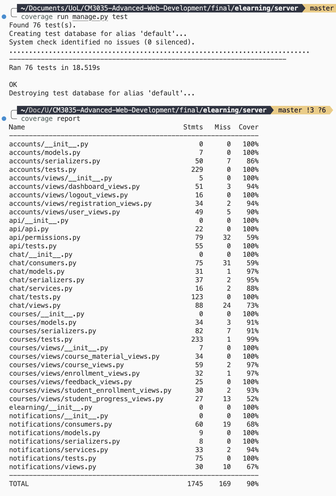

# Report: eLearning Web Application

CM3035 - Advanced Web Development

Student Name: Yue Wu

Date: March 10, 2025

## 1. Introduction

For this module assignment, I developed an e-learning platform that fulfills the requirements of the assignment. This project gave me the opportunity to apply advanced web development concepts in a practical context.

I approached this project by first planning the database structure and then implementing the backend and frontend components incrementally. I used:

- Django and Django REST Framework for the backend API
- Redis and Django Channels for WebSocket functionality
- React with Next.js for the frontend
- JWT for authentication
- Factory Boy and Django test framework for testing

## 2 Module and database design

After analyzing the project requirements, I first designed the database models and then decided to structure my e-learning platform using a modular architecture with five distinct modules. This approach helped me maintain separation of concerns and made the codebase more maintainable.

### 2.1 Modular Architecture Design

I organized my application into five core modules, each with a specific responsibility:

**1. Accounts Module**

I extended Django's `AbstractUser` to leverage its built-in security features while adding my own role-based functionality. I created two roles: `student` and `teacher`, and enforced permission checks throughout the application. This approach maintains compatibility with Django's admin interface and leaves room for future authentication extensions like OAuth or SSO without requiring major refactoring.

**2. Courses Module**

For course management, I created 4 models: `Course`, `CourseMaterial`, `Enrollment`, and `Feedback`. I implemented normalized relationships to enable bidirectional querying (for example, finding all students in a course or all courses a student is enrolled in). I also added an `is_active` flag for soft deletion, which preserves historical data and prevents accidental data loss. The detailed timestamps I included help with tracking creation, updates, and user progress.

**3. Notifications Module**

I kept the notification system simple but effective, focusing on essential attributes like recipient, message, read status, and timestamp. This lightweight implementation reduces database overhead while still providing the flexibility to accommodate various notification types. The read status tracking enables unread notification tracking, which improves the user experience.

**4. Chat Module**

I implemented a chat system that supports both text messages and file attachments, with utility methods directly on the model for common operations. I added database indexes to optimize performance for frequent queries and implemented read status tracking to support notification features. By encapsulating complex query logic within model methods like `get_chat_messages` and `get_chat_sessions`, I reduced code duplication across the application.

**5. API Module**

I centralized all API endpoints in a single location using a hierarchical routing structure with nested routers. This approach provides a clear overview of all available endpoints, simplifies API documentation, and enforces consistent URL patterns across the application. The hierarchical structure reflects the natural relationships between resources and reduces code duplication.

### 2.2 Database Design Patterns



Throughout my database design, I applied several key patterns:

**- User Model Extension**

By extending Django's built-in authentication, I maintained native security features while adding only the essential custom fields I needed.

**- Normalized Relationships**

I created junction tables like Enrollment for many-to-many relationships and used descriptive related_name attributes for all relationships, which improves code readability and query capabilities.

**- File Management System**

I separated upload directories by content type (profile photos, course materials, chat files) to prevent namespace collisions and enable type-specific security policies.

**- Soft Delete Implementation**

Instead of permanent deletion, I added is_active flags to key models, which preserves historical data and enables data recovery if needed.

**- Metadata Tracking**

I added timestamp fields with automatic updates, which supports chronological sorting, activity tracking, and user progress monitoring.

**- Performance Optimization**

I strategically added database indexes on frequently queried fields and implemented model methods for common complex queries to improve performance and maintainability.

This modular architecture and thoughtful database design created a robust foundation for my e-learning platform, balancing performance, maintainability, and extensibility. The clear separation of concerns between modules and the consistent application of database design patterns allowed me to build a sophisticated web application that meets all the project requirements.

## 3 User Authentication and Permissions

The second thing I did is to implement the user authentication and permissions.

### 3.1 Security and Access Control

I ensured that only authenticated users can access the e-learning platform content.

I used JWT to verify user identity across the platform. By using token-based authentication with refresh capabilities, I ensured that users maintain secure sessions while minimizing database queries.

### 3.2 Role-Based Access Control

Based on project requirements and common sense, I designed a role-based permission system that differentiates between teachers and students, ensuring each user type has appropriate access rights:

In `server/api/permissions.py` I implemented five custom permission classes to enforce fine-grained access control throughout the e-learning platform:

**1. IsTeacher Permission**

This permission class restricts access to teacher-specific functionality. It performs a dual verification by checking both authentication status and role assignment:

**2. IsStudent Permission**

Similar to the teacher permission, this class restricts access to student-specific functionality. This permission is used for features that should only be available to students, such as enrollment functionality or student dashboards, preventing teachers from accessing student-only features.

**3. IsCourseTeacher Permission**

This permission class enforces course ownership, ensuring that teachers can only modify courses they've created. The class handles both direct course access and nested resource access (like course materials) by checking URL parameters. It also implements object-level permissions to verify ownership at the instance level, working with both Course objects and related objects that have a course attribute.

**4. IsEnrolledStudent Permission**

This permission class ensures that students can only access course material and related resources after they're enrolled in. Like the IsCourseTeacher permission, it implements both view-level and object-level permission checks, verifying enrollment status through database queries. This prevents students from accessing courses they haven't enrolled in, maintaining course privacy and access control.

**5. IsCourseTeacherOrEnrolledStudent Permission**

This hybrid permission class implements role-based access control with different permission levels. It grants full access to course teachers while limiting enrolled students to read-only operations (GET, HEAD, OPTIONS). This allows course materials to be viewable by enrolled students but only modifiable by the teacher who created them, implementing a practical read/write permission model.

These permission classes work together to create a security system that enforces role-based access control, resource ownership, and enrollment status throughout the application. By combining these permissions in different views, I created a flexible yet secure authorization system that protects sensitive data while providing appropriate access to legitimate users.

### 3.3 Frontend-Backend Integration

I built the frontend of this application using React and Next.js. I implemented a authentication context on the frontend that works seamlessly with the backend security system. The AuthContext provider manages user authentication state, handles token storage and refresh, and provides authentication status across the application. I also included user.role in the context to display role-specific content on the same page.

The frontend authentication system includes features like:

- Automatic token verification
- Secure storage of authentication credentials
- Multi-tab support for consistent authentication state
- Automatic redirects for unauthenticated users

### 3.4 Secure Logout Mechanism

To prevent unauthorized access after a user session ends, I implemented a secure logout system that:

- Blacklists refresh tokens to prevent reuse
- Clears local storage of authentication data
- Updates application state to reflect logged-out status
- Redirects users to appropriate pages

### 3.5 Enhanced User Experience

The permission system improves user experience by:

- Showing users only the resources they have access to
- Providing clear feedback when access is denied
- Automatically redirecting users to appropriate pages based on authentication status
- Supporting different views and capabilities based on user roles

By implementing this authentication and permission system, I've created a secure, role-appropriate environment that protects sensitive data while providing a seamless user experience tailored to each user's role in the educational process.

## 4. Frontend design

After designed the database models and authentication/permission controls, I actually felt lost about how many APIs I need to build and what should each API do, so I decided to wireframe the frontend first. In designing the frontend, I had to make decisions about what each page should display and what each button should do. This helped me to design the APIs based on the frontend requirements. I also created API endpoint documentation to ensure that the frontend and backend are in sync, especially the naming of the APIs, the JSON response format, and their permission class.

I built the frontend of my e-learning platform using React with Next.js, employing a modern component-based architecture with TypeScript for type safety. The application follows a clear organizational structure:

- App Directory: Implements Next.js App Router for page-based routing
- Components Directory: Contains reusable UI components organized by feature
- Contexts Directory: Manages global state like authentication and user data
- Utils Directory: Houses utility functions for common operations
- Lib Directory: Contains core functionality like authentication helpers
- Types Directory: Defines TypeScript interfaces for type safety

This structure follows the separation of concerns principle, making the codebase maintainable and scalable as new features are added.

### 4.1 Key Pages and Features

The frontend includes 6 pages and 3 major components. The pages are:

**1. Welcome Page**

- Implements toggle functionality between login and registration forms
- Includes authentication state checking to redirect logged-in users

**2. Dashboard Page**

- Acts as the user's personal hub after authentication
- Displays user profile information with editable status and photo
- Shows courses the user created or enrolled in
- Implements course creation functionality for teachers only

**3. Courses Page**

- Presents a grid of all available courses
- Shows course details including teacher information and enrollment counts
- Implements enrollment functionality for students only

**4. Course Detail Page**

- Provides view of individual course metadata
- Implements tab-based navigation for course materials, enrollments, and feedback
- Features role-based UI that adapts to user permissions, such as course materials management for cours teachers and feedback for enrolled students

**5. Members Page**

- Displays user profiles with status updates
- Only teachers can access this page

**6. Member Details Page**

- Provides detailed view of individual user profiles

The 3 major components are:

**1. Search component**

- Enable teachers to search for courses and members
- Enable students to search for courses

**2. Notification component**

- Implement real-time notifications for course enrollments and course material updates
- Display read status of notifications and mark as read functionality

**3. Chat component**

- Implement real-time chat functionality between users
- Enable file attachment
- Display chat sessions (all the users the user has chatted with) and chat history of the active chat session

### 4.2 Implementation Highlights

**1. Authentication Integration**

The frontend integrates with the JWT authentication system, handling token storage, refresh, and verification. The application includes automatic redirection for unauthenticated users and maintains consistent authentication state across multiple tabs.

**2. Context-Based State Management**

I implemented custom context providers like AuthContext and UserContext to manage global state, eliminating prop drilling and providing a clean way to access authentication and user data throughout the application.

**3. Role-Based UI Rendering**

The frontend intelligently adapts its interface based on user roles and permissions. For example, teachers see course creation and management options, while students see enrollment buttons. This conditional rendering is implemented at the component level, making the UI intuitive for each user type.

**4. Progressive Enhancement**

I implemented progressive enhancement techniques like optimistic UI updates, which update the interface immediately before API calls complete, making the application feel more responsive. The code also includes fallback states for when data is loading or errors occur.

**5. Error Handling and Feedback**

I implemented error handling with user-friendly error messages and loading states. The application uses toast notifications via the Sonner library to provide immediate feedback for user actions, enhancing the overall user experience.

**6. Component Reusability**

I created UI component using Shadcn UI and Tailwind CSS, which provides consistent styling while maintaining customizability.

This frontend design creates a intuitive user experience while maintaining clean code organization and following modern React best practices. The combination of TypeScript, Next.js, and component-based architecture ensures the application is both maintainable and extensible for future feature additions.

## 5. REST API

I used Django REST Framework to provide a robust interface between the frontend and backend of my e-learning platform. My API architecture is organized into a main router for top-level resources and nested routers for related resources, creating a logical and intuitive URL structure. The API endpoints are centralized in `/server/api/api.py` while the `views.py` files are separated in the corresponding module directories.

### 5.1 Authentication Endpoints

```
POST /api/auth/login/ - JWT token acquisition
POST /api/auth/register/ - User registration
POST /api/auth/refresh/ - JWT token refresh
POST /api/auth/verify/ - JWT token verification
POST /api/auth/logout/ - User logout with token blacklisting
```

### 5.2 User Management Endpoints

```
# dashboard
GET /api/dashboard/ - Get current user dashboard data
PATCH /api/dashboard/patch-status/ - Update user status
PATCH /api/dashboard/patch-photo/ - Update user profile photo

# members
GET /api/members/ - List all users (teachers only)
GET /api/members/{id}/ - Retrieve user details
GET /api/members/search/ - Search for users by name or username (teachers only)
```

### 5.3 Course Management Endpoints

```
GET /api/courses/ - List all active courses
POST /api/courses/ - Create a new course (teachers only)
GET /api/courses/{id}/ - Retrieve course metadata
PATCH /api/courses/{id}/ - Update course metadata (course teacher only)
PATCH /api/courses/{id}/toggle_activation/ - Activate/deactivate course (course teacher only)
GET /api/courses/search/ - Search courses
```

### 5.4 Course Resources Endpoints (Nested)

```
# materials
GET /api/courses/{course_id}/materials/ - List course materials (course teacher and enrolled students only)
POST /api/courses/{course_id}/materials/ - Add course material (course teacher only)
DELETE /api/courses/{course_id}/materials/{id}/ - Delete course material (course teacher only)

# feedback
GET /api/courses/{course_id}/feedback/ - List course feedback (course teacher and enrolled students only)
POST /api/courses/{course_id}/feedback/ - Add feedback (enrolled students only)
DELETE /api/courses/{course_id}/feedback/{id}/ - Delete feedback (enrolled students only)

# enrollments
GET /api/courses/{course_id}/enrollments/ - List course enrollments (course teacher and enrolled students only)
DELETE /api/courses/{course_id}/enrollments/ - Delete course enrollments (course teacher only)

# student enrollment
POST /api/courses/{course_id}/student-enrollment/ - Enroll in course (students only)
DELETE /api/courses/{course_id}/student-enrollment/ - Leave course (students only)

PATCH /api/courses/{course_id}/progress/toggle_completion/ - Toggle course completion (enrolled student only)
```

### 5.5 Communication Endpoints

```
# chat
GET /api/chat/ - List chat sessions
POST /api/chat/ - Send a message
GET /api/chat/{id}/ - Retrieve chat session
POST api/chat/mark_chat_read/ - Mark chat as read
POST /api/chat/initialize/ - Initialize chat session

# notifications
GET /api/notifications/ - List user notifications
PATCH /api/notifications/{id}/ - Mark notification as read
POST /api/notifications/mark_all_read/ - Mark all notifications as read
```

(The JSON response format is too long to be shown here.)

This hierarchical API structure provides a clear and consistent interface for the frontend to interact with the backend, with each endpoint having specific permission requirements based on user roles and resource ownership.

### 5.6 Implementation Example: CourseViewSet

The CourseViewSet in course_views.py exemplifies my approach to implementing ViewSets with dynamic permission handling and context-aware serialization:

```python
class CourseViewSet(viewsets.ModelViewSet):
"""
API endpoint for managing courses.
"""
serializer_class = CourseSerializer
permission_classes = [IsAuthenticated]

    def get_queryset(self):
        # Base queryset excluding admin users
        base_queryset = Course.objects.exclude(
            Q(teacher__is_superuser=True) | Q(teacher__is_staff=True)
        ).order_by("-updated_at")

        # For list view, show only active courses
        if self.action == "list":
            return base_queryset.filter(is_active=True)

        return base_queryset
```

This ViewSet demonstrates several key implementation patterns:

**1. Dynamic Permission Handling**

I implemented action-specific permission checks that adapt based on the requested operation:

```python
def get_permissions(self):
"""Set permissions based on action type."""
if self.action == "create":
self.permission_classes = [IsAuthenticated, IsTeacher]
elif self.action in ["update", "partial_update", "destroy"]:
self.permission_classes = [IsAuthenticated, IsCourseTeacher]
else:
self.permission_classes = [IsAuthenticated]

    return super().get_permissions()
```

This ensures that only teachers can create courses, only course teachers can modify them, and all authenticated users can view them, implementing a fine-grained access control system that enforces business rules at the API level.

**2. Context-Aware Serialization**

The ViewSet selects the appropriate serializer based on the context of the request:

```python
def get_serializer_class(self):
"""Return appropriate serializer based on the request method and action."""
if self.action == "list":
return CourseListSerializer # Lightweight serializer for lists
elif self.action == "retrieve":
return CourseDetailSerializer # Detailed serializer for single course
return CourseSerializer # Default serializer for other operations
```

This approach optimizes performance by returning only necessary fields for each context, reducing payload size for list views while providing data for detail views.

**3. Custom Actions**

I extended the standard CRUD operations with custom actions using DRF's @action decorator:

```python
@action(
detail=True,
methods=["patch"],
permission_classes=[IsAuthenticated, IsCourseTeacher],
)
def toggle_activation(self, request, pk=None):
"""Toggle the activation status of a course."""
course = self.get_object()
course.is_active = not course.is_active
course.save()

    return Response({
        "status": "success",
        "is_active": course.is_active,
        "message": f'Course {"activated" if course.is_active else "deactivated"} successfully',
    }, status=status.HTTP_200_OK)
```

This pattern allows me to implement non-standard operations while maintaining RESTful principles and consistent permission handling.

**4. Enhanced Object Retrieval**

I overrode the get_object method to implement additional permission checks beyond what DRF provides by default:

```python
def get_object(self):
"""Override get_object to enforce permissions."""
obj = super().get_object()
user = self.request.user

    # Only course teacher can access inactive courses
    if not obj.is_active and obj.teacher != user:
        self.permission_denied(
            self.request,
            message="You do not have permission to access this inactive course.",
        )

    self.check_object_permissions(self.request, obj)
    return obj
```

This ensures that inactive courses are only accessible to their creators, adding a layer of business logic enforcement that complements the permission system.

### 5.7 API Design Principles

Throughout my API implementation, I followed several key design principles:

- Consistent Response Format

All API responses follow a consistent structure, making it easier for the frontend to parse and handle responses.

- Proper HTTP Status Codes

Each endpoint returns appropriate HTTP status codes (200 for success, 400 for bad requests, 403 for permission issues, etc.), following REST conventions.

- Documentation

All ViewSets and methods include detailed docstrings explaining their purpose, parameters, and return values.

- Optimized Queries

ViewSets implement optimized database queries using Django's ORM features like select_related and prefetch_related to minimize database hits.

- Validation and Error Handling

All input data is validated through serializers, with clear error messages returned when validation fails.

This API implementation provides a solid foundation for the frontend-backend communication in my e-learning platform, ensuring that data is transferred securely and efficiently while enforcing the application's business rules and permission requirements.

## 6 WebSockets

I implemented real-time communication in my e-learning platform using Django Channels and WebSockets to provide instant notifications and chat functionality. My implementation follows a dual approach with two distinct WebSocket consumers that handle different types of real-time data.

### 6.1 WebSocket Architecture

My WebSocket architecture consists of two primary consumers:

1. **NotificationConsumer**: Handles system-generated notifications
2. **ChatConsumer**: Manages real-time chat functionality

Both consumers share a similar connection pattern but differ in their data flow models:

### 6.2 Notification System: Direct WebSocket Model

The notification system follows a straightforward WebSocket model where notifications are sent directly through the WebSocket connection:

1. **Backend Generation**: A notification is created in the backend
2. **WebSocket Delivery**: The notification is immediately sent to the user's notification group
3. **Frontend Display**: The frontend receives and displays the notification in real-time

This direct approach is efficient for simple notification content that doesn't require persistence before delivery.

### 6.3 Chat System: API-WebSocket Hybrid Model

For the chat functionality, I implemented a more complex hybrid model that combines REST API calls with WebSocket notifications:

1. **Message Creation via API**: Messages (especially those with file attachments) are first sent to the backend via HTTP API
2. **Database Persistence**: The message is stored in the database
3. **WebSocket Notification**: A notification about the new message is sent via WebSocket
4. **Frontend Update**: The frontend receives the notification and updates the UI accordingly

This hybrid approach offers several advantages:

- **File Handling**: Supports file uploads through the standard HTTP multipart form
- **Reliable Delivery**: Ensures messages are persisted before notification
- **Consistent State**: Maintains a single source of truth in the database

On the backend, after storing the message, I use the channel layer to notify connected clients:

```python
# Notify via WebSocket after API processing
async_to_sync(channel_layer.group_send)(
    f"user_{receiver_id}_chat",
    {"type": "chat_message_notification", "message": message_data},
)
```

### 6.4 Authentication and Security

Both WebSocket consumers implement JWT-based authentication to ensure secure connections:

1. **Token Transmission**: JWT token is passed as a query parameter during connection
2. **Token Validation**: The token is validated on the server side
3. **User-Specific Groups**: Each user is added to their own channel group

This approach ensures that:

- Only authenticated users can establish WebSocket connections
- Users only receive messages intended for them
- The system can handle multiple concurrent users

By implementing these WebSocket-based real-time features, my e-learning platform delivers a responsive and interactive user experience that enhances collaboration between teachers and students.

## 7. Testing

I conducted automated testing using Django's testing framework and Django REST Framework's testing utilities. I extensively tested all API endpoints, the permission system, and WebSocket functionality, achieving 90% code coverage across the entire codebase.



I organized tests using a hierarchical approach with factories for test data generation and specialized test classes for different functional areas. Each test class focuses on a specific functional area with clear test methods. My testing ensures:

1. **Modular Testing**: Each application module has its own dedicated test file with specialized test cases
2. **Factory-Based Fixtures**: Used Factory Boy to create test data with consistent patterns
3. **Authentication Testing**: Verified proper access control for all endpoints
4. **Edge Case Coverage**: Tested both happy paths and error conditions
5. **Isolation**: Each test runs in isolation with a clean database state

By implementing this thorough testing approach, I ensured that my e-learning platform is robust, secure, and functions as expected across all components

## 8. Evaluation

My e-learning platform successfully implements key requirements while demonstrating several strengths and areas for improvement.

### 8.1 Strengths

**Architecture and Design**

- Used React and Next.js for frontend following the trend in industry
- Modular backend with clear separation of concerns enhances maintainability
- Hybrid communication model effectively combines RESTful APIs and WebSockets
- JWT-based authentication secures both HTTP and WebSocket connections

**Implementation Quality**

- 90% test coverage ensures reliability and functionality
- Comprehensive permission system protects resources appropriately
- Real-time features enhance user engagement and communication

### 8.2 Limitations

**Technical Challenges**

- Could have used Django-Ninja for more modern, robust, easy-to-maintain API
- Simple validations are conducted but could benefit from more robust edge case handling and more advanced validation.
- Didn't deploy the application to a production environment.
- Used SQLite database for development and testing instead of PostgreSQL.

**User Experience and Security**

- Mobile responsiveness and accessibility considerations are limited
- Rate limiting and advanced security measures aren't fully implemented

### 8.3 Future Improvements

If undertaking this project again, I would prioritize project planning by developing a detailed Product Requirements Document before writing any code. The absence of thorough planning led to significant code refactoring and wasted a lot of development time. Modifying features post-implementation required cascading changes to dependencies, creating a time-consuming and error-prone process. On multiple occasions, previously functional code broke after implementing changes. Additionally, I would adopt a test-driven development approach, writing unit tests before implementation code. This methodology would provide immediate validation of functionality and eliminate prolonged debugging sessions, ultimately resulting in more robust and maintainable code. Besides the above, I would also:

1. **Enhanced WebSocket Architecture**: Implement robust reconnection strategies and error handling
2. **Simplified Permission System**: Improve maintainability and documentation
3. **Advanced Analytics**: Develop better progress visualization for students and teachers
4. **Infrastructure Improvements**: Use PostgreSQL and implement proper media storage
5. **Mobile and Accessibility Focus**: Ensure responsive design and WCAG compliance
6. **DevOps Integration**: Implement Docker and CI/CD pipelines

### 8.4 Conclusion

My e-learning platform successfully delivers core functionality with a strong focus on real-time communication through WebSockets. The architecture demonstrates good separation of concerns, high test coverage, and thoughtful technology choices. The implementation balances modern web technologies with practical design decisions, creating a solid foundation. The development process provided valuable insights into building complex web applications with real-time features, which would significantly inform future iterations of the project.

## 9. Setup and Usage Instructions

### 9.1 Install Backend

For backend, this project is using:

- macOS Sequoia Version 15.3.1
- Python 3.12.9
- Django 5.1.3
- redis 7.2.7

Please download redis, open a terminal and run:

```bash
redis-server
```

Please open a new terminal and then run:

```bash
cd server
conda create --name elearning-project python=3.12.9
conda activate elearning-project
pip install -r requirements.txt
daphne -b 0.0.0.0 -p 8000 elearning.asgi:application
```

The admin address is http://127.0.0.1:8000/admin/

The admin login credentials are:

- **Username**: admin
- **Password**: admin

### 9.2 Install Frontend

For frontend, open a new terminal and run:

```bash
cd client
npm install
npm run dev
```

You can then open http://192.168.0.101:3000/ to see the frontend.

(If the backend address is not http://127.0.0.1:8000, please modify the NEXT_PUBLIC_API_URL in the client/.env file accordingly.)

Sample user login credentials:

- Teacher:

  - **Username**: teacher1 / teacher2 / teacher3
  - **Password**: elearning

- Student:
  - **Username**: student1 / student2 / student3 / student4 / student5 / student6 / student7 / student8 / student9 / student10
  - **Password**: elearning

### 9.3 Running the Tests

To run unit tests, open a new terminal and run:

```bash
cd server
coverage run manage.py test
coverage report
```

## 10. requirements.txt

```txt
asgiref==3.8.1
astroid==3.3.8
attrs==25.1.0
autobahn==24.4.2
Automat==24.8.1
cffi==1.17.1
channels==4.2.0
channels_redis==4.2.1
constantly==23.10.4
coverage==7.6.12
cryptography==44.0.2
daphne==4.1.2
dill==0.3.9
Django==5.1.3
django-cleanup==9.0.0
django-cors-headers==4.7.0
django-coverage-plugin==3.1.0
djangorestframework==3.15.2
djangorestframework_simplejwt==5.5.0
drf-nested-routers==0.94.1
factory_boy==3.3.3
Faker==37.0.0
hyperlink==21.0.0
idna==3.10
incremental==24.7.2
isort==6.0.1
mccabe==0.7.0
msgpack==1.1.0
pillow==11.1.0
platformdirs==4.3.6
pyasn1==0.6.1
pyasn1_modules==0.4.1
pycodestyle==2.12.1
pycparser==2.22
pyflakes==3.2.0
PyJWT==2.9.0
pylint==3.3.4
pylint-django==2.6.1
pylint-plugin-utils==0.8.2
pyOpenSSL==25.0.0
redis==5.2.1
service-identity==24.2.0
setuptools==75.8.0
sqlparse==0.5.2
tomlkit==0.13.2
Twisted==24.11.0
txaio==23.1.1
typing_extensions==4.12.2
tzdata==2025.1
wheel==0.45.1
zope.interface==7.2
```
