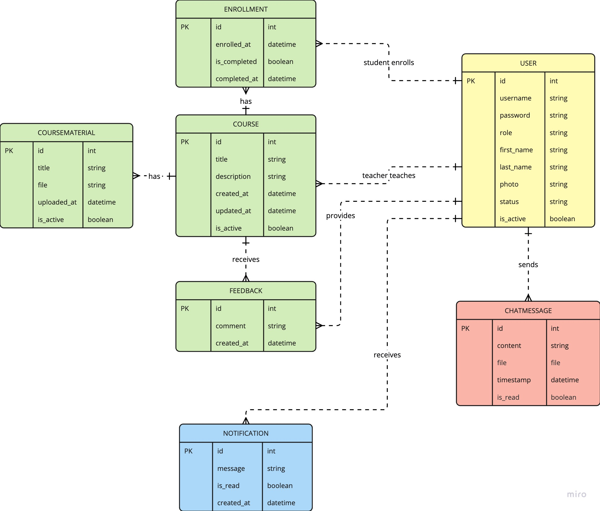

# Report: eLearning Web Application

CM3035 - Advanced Web Development

Student Name: Yue Wu

Date: March 10, 2025

## 1. Introduction

Brief overview of the project's purpose and scope.
Key objectives:
Develop a Django-based eLearning platform with user roles (students/teachers).
Implement RESTful APIs, WebSocket communication, and real-time features.
Demonstrate mastery of Django, Celery, Django Channels, authentication, and database design.

## 2. Application Design and Implementation

## 2.1 Database Schema

Models and Relationships :
Describe User (custom user model), Student, Teacher, Course, Enrollment, Feedback, StatusUpdate, CourseMaterial, and ChatMessage models.
Include an ER diagram (e.g., using draw.io ) to visualize relationships.
Normalization : Explain how you avoided redundancy (e.g., separating CourseMaterial from Course).

## 2.2 User Authentication and Permissions

How users register/login (Django’s built-in auth + custom roles).
Role-based access control:
Teachers can create courses, view enrolled students, and block users.
Students can enroll in courses, leave feedback, and post status updates.

## 2.3 REST API

Endpoints for user data (e.g., /api/users/, /api/courses/).
Use of Django REST Framework (serializers, viewsets, permissions).
Example API request/response (e.g., retrieving course details).

## 2.4 Real-Time Features (WebSockets)

Chat System :
Implementation using Django Channels (consumers, routing).
How WebSocket connections handle real-time messaging between users.
Notifications:
Student enrollment notifications for teachers.
Course material updates for students.

## 2.5 Additional Features

Course enrollment workflow.
Feedback system for courses.
Status updates on user profiles.
File uploads for course materials (PDFs/images).

## 3. Technical Implementation

## 3.1 Key Code Snippets

Highlight critical code sections (e.g., WebSocket consumer, REST API serializer, model methods).
Example:

Example: WebSocket consumer for chat

class ChatConsumer(AsyncWebsocketConsumer):
async def connect(self):
self.room_name = self.scope['url_route']['kwargs']['course_id']
await self.channel_layer.group_add(self.room_name, self.channel_name)
await self.accept()

## 3.2 Testing

Unit Tests : Describe tests for models, views, and APIs (e.g., test_course_creation, test_student_enrollment).
Test Coverage : Tools used (e.g., pytest, Django’s test client).
Instructions to run tests:
bash
复制
1
python manage.py test

## 3.3 Challenges and Solutions

Example:
Challenge : Real-time notifications for course updates.
Solution : Used Celery for asynchronous tasks + Django Channels for WebSocket communication.

## 4. Critical Evaluation

## 4.1 Strengths

Robust role-based access control.
Scalable WebSocket implementation for real-time features.
Clean REST API design.

## 4.2 Weaknesses

Limited WebSocket features (e.g., no audio/video streaming).
Minimal frontend styling (if applicable).

## 4.3 Future Improvements

Add a whiteboard feature for teachers.
Implement automated grading for assignments.

## 5. Setup and Usage Instructions

## 5.1 Install Backend

For backend, this project is using:

- macOS Sequoia Version 15.3.1
- Python 3.12.9
- Django 5.1.3
- redis 7.2.7

Please open a terminal and run:

```bash
redis-server
```

Please open a new terminal and then run:

```bash
cd server
conda create --name elearning-project python=3.12.9
conda activate elearning-project
pip install -r requirements.txt
daphne -b 0.0.0.0 -p 8000 elearning.asgi:application
```

The admin address is http://127.0.0.1:8000/admin/

The admin login credentials are:

- **Username**: admin
- **Password**: admin

## 5.2 Install Frontend

For frontend, open a new terminal and run:

```bash
cd client
npm install
npm run dev
```

You can then open http://192.168.0.101:3000/ to see the frontend.

If the backend address is not http://127.0.0.1:8000, please modify the NEXT_PUBLIC_API_URL in the client/.env file.

Sample user login credentials:

- Teacher:

  - **Username**: teacher1 / teacher2 / teacher3
  - **Password**: elearning

- Student:
  - **Username**: student1 / student2 / student3 / student4 / student5 / student6 / student7 / student8 / student9 / student10
  - **Password**: elearning

## 5.2 Running the Tests

To run unit tests, open a new terminal and run:

```bash
cd server
coverage run manage.py test
coverage report
```

## 6. Conclusion

Summary of achievements (e.g., met all R1-R5 requirements).
Key learning outcomes (Django Channels, REST APIs, database design).

## 7. Appendices

## 7.1 Appendix A: Full ER diagram



## 7.2 Appendix B: Test results/output.


## 7.3 Appendix C: requirements.txt contents.

```txt
asgiref==3.8.1
astroid==3.3.8
attrs==25.1.0
autobahn==24.4.2
Automat==24.8.1
cffi==1.17.1
channels==4.2.0
channels_redis==4.2.1
constantly==23.10.4
coverage==7.6.12
cryptography==44.0.2
daphne==4.1.2
dill==0.3.9
Django==5.1.3
django-cleanup==9.0.0
django-cors-headers==4.7.0
django-coverage-plugin==3.1.0
djangorestframework==3.15.2
djangorestframework_simplejwt==5.5.0
drf-nested-routers==0.94.1
factory_boy==3.3.3
Faker==37.0.0
hyperlink==21.0.0
idna==3.10
incremental==24.7.2
isort==6.0.1
mccabe==0.7.0
msgpack==1.1.0
pillow==11.1.0
platformdirs==4.3.6
pyasn1==0.6.1
pyasn1_modules==0.4.1
pycodestyle==2.12.1
pycparser==2.22
pyflakes==3.2.0
PyJWT==2.9.0
pylint==3.3.4
pylint-django==2.6.1
pylint-plugin-utils==0.8.2
pyOpenSSL==25.0.0
redis==5.2.1
service-identity==24.2.0
setuptools==75.8.0
sqlparse==0.5.2
tomlkit==0.13.2
Twisted==24.11.0
txaio==23.1.1
typing_extensions==4.12.2
tzdata==2025.1
wheel==0.45.1
zope.interface==7.2
```
